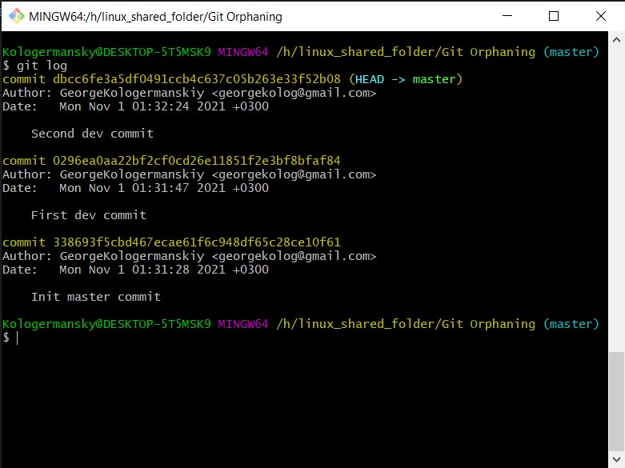
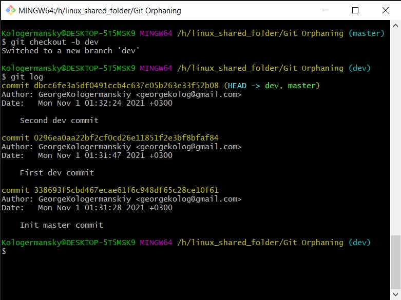
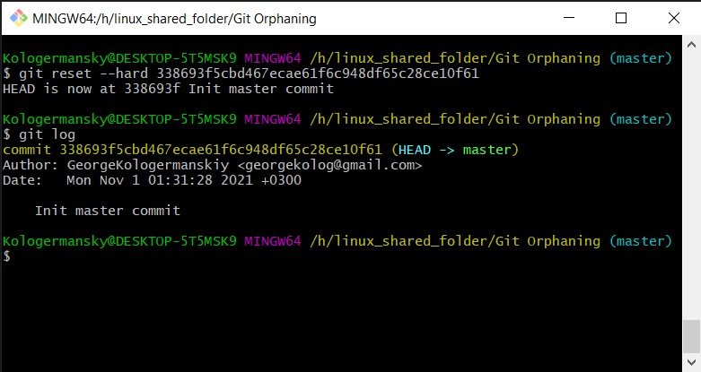

# Git Orphaning

## Входные данные

Имеется:
* `Init master commit` - базовый коммит мастера
* `First dev commit` - первый коммит, который должен быть в `dev`
* `Second dev commit` - второй коммит, который должен быть в `dev`

Основная задача - перекинуть `Second dev commit` в ветку `dev`, а голову `master` перенести на `Init master commit`

## Настраиваем ветку `dev`

Для этого достаточно просто создать ветку `dev` от `master`. Также можно сделать `git checkout --orphan dev && git cherry-pick `

## Восстанавливаем `master`

Тут необходимо найти последний коммит мастера, после чего сделать `git reset` по нему

## Итог

После этого можно делать `merge request` из `dev` в `master`, на котором можно проводить ревью.